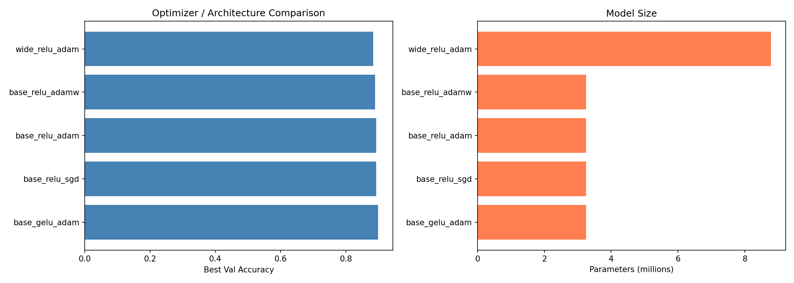
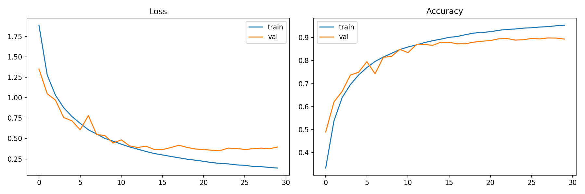
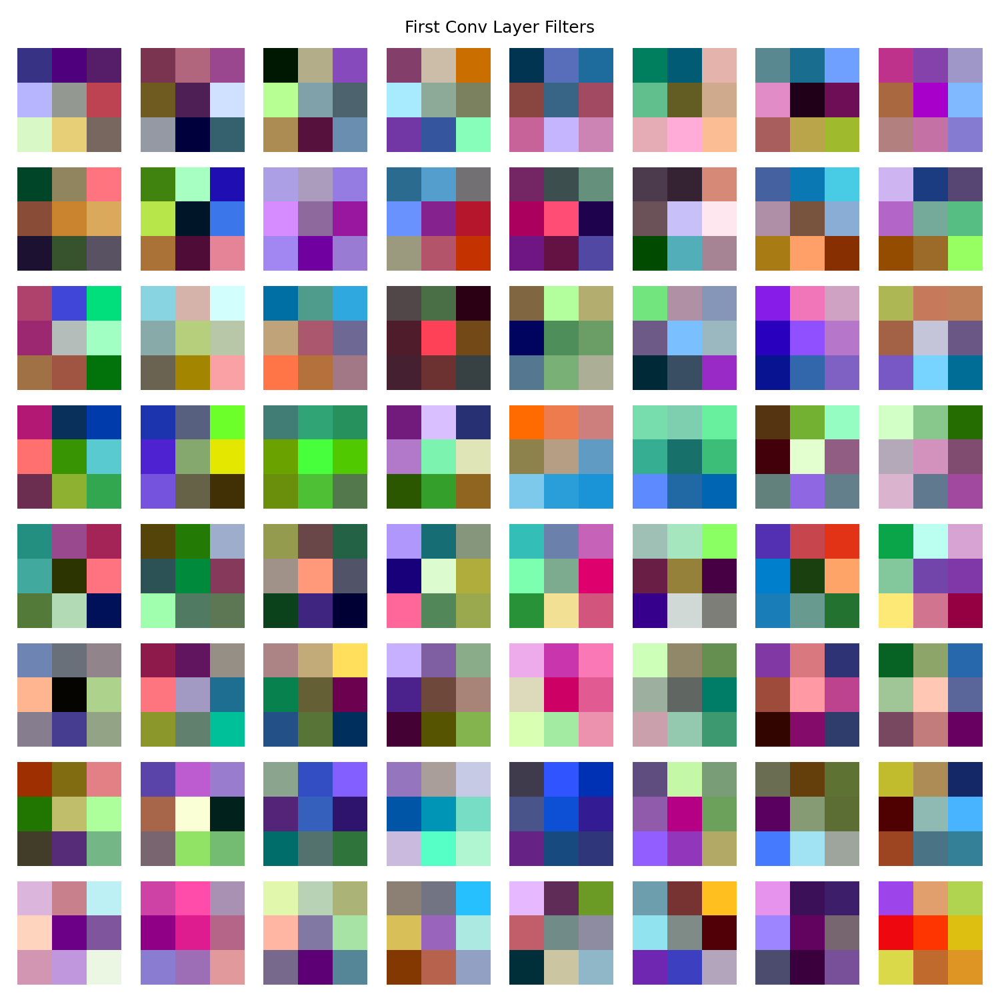
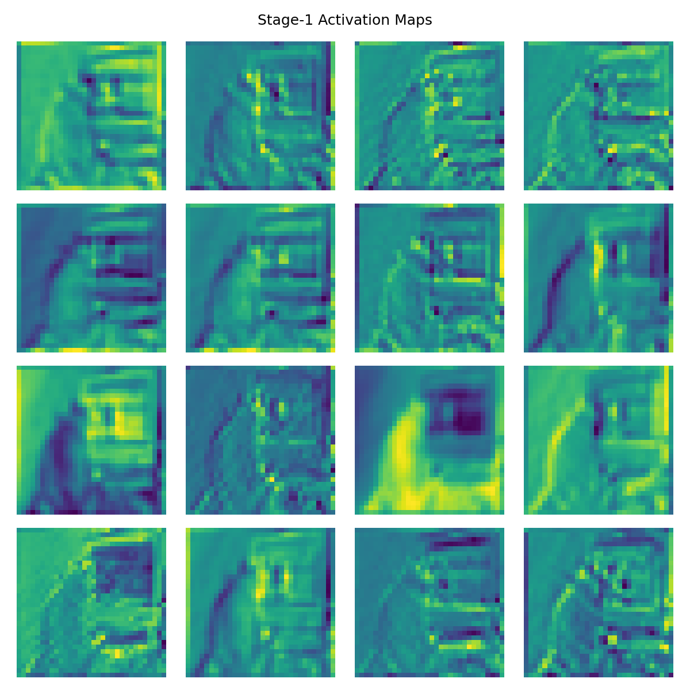
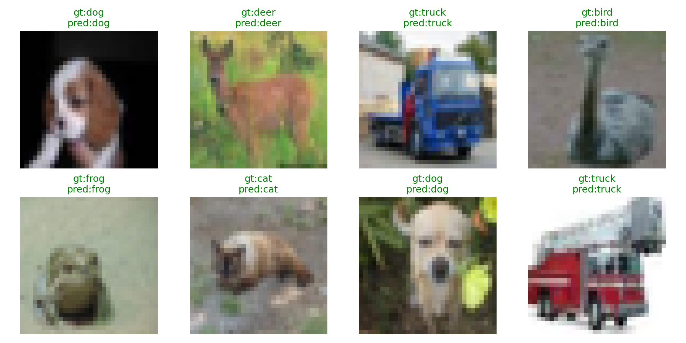
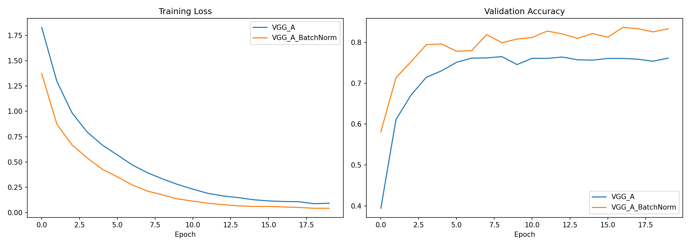
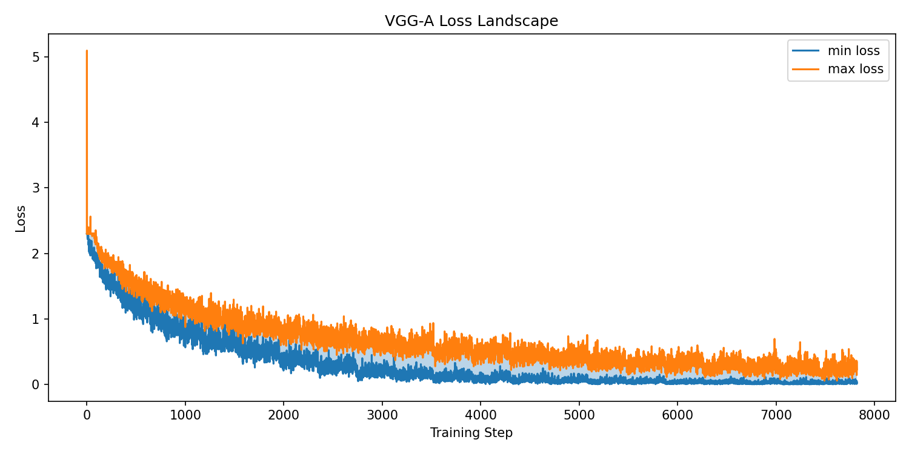
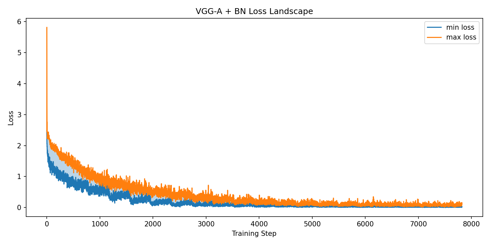
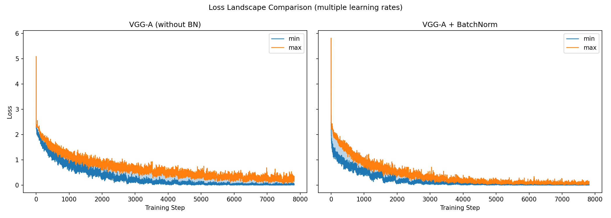
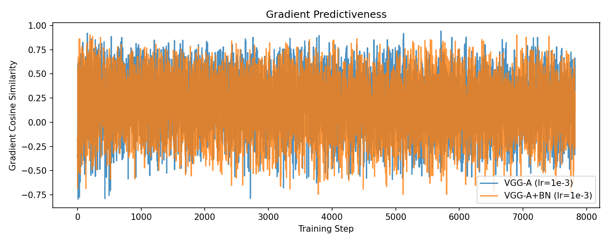

# Project-2：神经网络与深度学习

**课程**：Neural Network and Deep Learning  
**日期**：2026年6月

---

## 摘要

本项目在 CIFAR-10 数据集上完成两部分实验：（1）设计并训练自定义卷积神经网络，对比不同网络结构、激活函数、优化器及正则化策略；（2）在 VGG-A 架构上实现 Batch Normalization，对比 BN 前后训练表现，并通过多学习率 Loss Landscape 实验分析 BN 对优化 landscape 的平滑作用。

**最佳分类结果**：CustomCNN（base + GELU + Adam）验证准确率 **89.82%**（test error **10.18%**），参数量 3.25M。

**代码仓库**：https://github.com/Mr-Rubio/Neural-Network-PJ2  
**数据集**：CIFAR-10，通过 `torchvision.datasets.CIFAR10(download=True)` 自动下载至 `data/` 目录，无需单独上传。

---

## 1. Part 1：CIFAR-10 自定义网络（60%）

### 1.1 数据集与预处理

CIFAR-10 包含 10 类、32×32 彩色图像，共 60,000 张（训练 50,000 / 测试 10,000）。本实验使用 PyTorch `torchvision` 加载数据。

**训练集增强**：
- `RandomCrop(32, padding=4)`
- `RandomHorizontalFlip()`
- 归一化：mean = (0.4914, 0.4822, 0.4465)，std = (0.2470, 0.2435, 0.2616)

**测试集**：仅 ToTensor + 归一化，无增强。

### 1.2 网络结构

自定义 CNN（`CustomCNN`）包含作业要求的全部必选组件，并额外使用 BatchNorm2d 与 Dropout。

**Base 配置**（通道 64 → 128 → 256，约 3.25M 参数）：

```
Input (3×32×32)
  → Stage1: [Conv-BN-ReLU]×2 → MaxPool(2×2)     → 64×16×16
  → Stage2: [Conv-BN-ReLU]×2 → MaxPool(2×2)     → 128×8×8
  → Stage3: [Conv-BN-ReLU]×2 → MaxPool(2×2)     → 256×4×4
  → Flatten → FC(512) → ReLU/GELU → Dropout(0.5) → FC(10)
```

**Wide 配置**（通道 128 → 256 → 512，约 8.78M 参数）：结构相同，通道数加倍。

| 组件类型 | 实现 |
|---------|------|
| 卷积层 Conv2d | 3×3，padding=1 |
| 池化层 MaxPool2d | 2×2 |
| 激活函数 | ReLU / GELU（对照实验） |
| 全连接层 Linear | 512 → 10 |
| BatchNorm2d | 每个 Conv 后 |
| Dropout | 分类器前，p=0.5 |

### 1.3 训练设置

| 超参数 | 值 |
|--------|-----|
| Batch size | 128 |
| Epochs | 30 |
| 随机种子 | 42 |
| 损失函数 | CrossEntropyLoss |
| 优化器 | Adam (lr=1e-3) / AdamW (lr=1e-3, wd=1e-2) / SGD (lr=0.1, momentum=0.9, wd=5e-4) |
| 学习率调度 | SGD 使用 CosineAnnealingLR |
| 硬件 | NVIDIA GeForce RTX 4060 Laptop GPU |
| 环境 | conda `newenv`，PyTorch 2.5.1+cu121 |

### 1.4 对照实验结果

共 6 组对照实验，结果按验证准确率降序排列：

| 排名 | 结构 | 激活 | 优化器 | Weight Decay | Val Acc | Test Error | 参数量 | 每 Epoch 耗时 |
|------|------|------|--------|--------------|---------|------------|--------|--------------|
| 1 | base | **GELU** | Adam | 0 | **89.82%** | **10.18%** | 3.25M | 26.2s |
| 2 | base | ReLU | SGD | 5e-4 | 89.20% | 10.80% | 3.25M | 25.3s |
| 3 | base | ReLU | Adam | 0 | 89.19% | 10.81% | 3.25M | 54.4s |
| 4 | base | ReLU | AdamW | 1e-2 | 88.92% | 11.08% | 3.25M | 28.5s |
| 5 | wide | ReLU | Adam | 0 | 88.29% | 11.71% | 8.78M | 170.2s |
| 6 | base | ReLU | Adam | 5e-4 | 86.61% | 13.39% | 3.25M | 28.2s |



### 1.5 结果分析

**（1）激活函数**：在相同 base 结构 + Adam 优化器下，GELU（89.82%）略优于 ReLU（89.19%）。GELU 的平滑非线性可能有助于梯度传播，对 CIFAR-10 的小分辨率图像略有收益。

**（2）优化器**：
- SGD + Momentum + CosineAnnealing（89.20%）与 Adam（89.19%）性能接近，但 SGD 训练更稳定，每 epoch 耗时更短。
- AdamW 因较强 weight decay（1e-2）略降精度，说明对该小网络正则化不宜过强。
- 额外 L2 正则（Adam + wd=5e-4）导致明显欠拟合（86.61%），该配置不适合本网络。

**（3）网络宽度**：wide 模型（8.78M 参数）准确率反而低于 base（88.29% vs 89.19%），且训练时间增加约 6 倍。在 CIFAR-10 上，适度容量 + 数据增强比单纯加宽更有效。

**（4）最佳模型**：选用 **base + GELU + Adam**，权重保存为 `reports/models/best_cifar10.pth`。

### 1.6 可视化

**训练曲线**（最佳配置 base + GELU + Adam）：



**第一层卷积核**（模型学到的边缘/颜色滤波器）：



**Stage-1 特征图**（对单张测试图像的前向激活）：



**预测样例**（绿色=正确，红色=错误）：



---

## 2. Part 2：Batch Normalization（30%）

### 2.1 实验设置

在 CIFAR-10 上使用 VGG-A 架构（适配 32×32 输入），对比：
- **VGG_A**：原始网络，Conv → ReLU → MaxPool
- **VGG_A_BatchNorm**：每个 Conv2d 后插入 BatchNorm2d，顺序为 Conv → BN → ReLU → MaxPool

训练超参：Adam，lr = 1e-3，batch size = 128，epochs = 20，随机种子 = 2020。

### 2.2 VGG-A 与 VGG-A+BN 对比

| 模型 | 最终 Val Accuracy | 相对提升 |
|------|-------------------|---------|
| VGG_A | 76.12% | — |
| VGG_A_BatchNorm | **83.29%** | **+7.17%** |



**分析**：
- BN 版本收敛更快，训练 loss 下降更平稳，验证准确率显著更高。
- BN 通过归一化每层输入的均值和方差，缓解内部协变量偏移（Internal Covariate Shift），使各层输入分布更稳定，从而允许使用更大学习率并加速收敛。
- 对于 VGG-A 这类较深网络，BN 的效果尤为明显（7%+ 精度提升）。

### 2.3 Loss Landscape 实验

#### 方法

参考 Santurkar et al. (2018) 的思路，在训练过程中测量 loss landscape 的 Lipschitz 性（平滑程度）：

1. 选取 4 个学习率：**[1e-3, 2e-3, 1e-4, 5e-4]**
2. 对每个学习率从头训练独立模型，记录每个 training step 的 batch loss
3. 在同一 step 上，取所有模型的 **max loss** 和 **min loss**，构成 `max_curve` 与 `min_curve`
4. 两曲线之间的区域（`fill_between`）反映 loss 对学习率的敏感程度——**带宽越窄，landscape 越平滑**

分别对 VGG_A 和 VGG_A_BatchNorm 重复上述流程。

#### 结果

**VGG-A（无 BN）Loss Landscape**：



**VGG-A + BN Loss Landscape**：



**对比图**：



**梯度可预测性**（相邻 step 梯度的余弦相似度，lr=1e-3）：



#### 分析

1. **Loss Landscape 带宽**：VGG-A+BN 的 min/max 曲线带宽明显窄于无 BN 版本。说明 BN 重参数化了优化问题，使 loss 对学习率变化的敏感度降低，optimization landscape 更加平滑。

2. **梯度可预测性**：BN 模型的梯度余弦相似度更高、波动更小，表明局部线性近似（梯度下降的基础）对 nearby loss 的预测更准确，优化过程更稳定。

3. **与学习率的关系**：无 BN 时，不同学习率（尤其 2e-3 vs 1e-4）在同一 step 的 loss 差异很大；有 BN 时差异显著缩小，说明 BN 使训练对超参数选择更鲁棒。

4. **结论**：BN 的益处不仅体现在最终精度，更体现在它使 optimization landscape 更平滑、梯度更可预测，从而加速并稳定训练过程。这与 Santurkar et al. 的 "BN reparametrizes the optimization problem" 观点一致。

---

## 3. 代码结构

```
PJ2_2026/
├── codes/
│   ├── CIFAR10/              # Part 1：自定义 CNN
│   │   ├── models/custom_cnn.py
│   │   ├── data/loaders.py
│   │   ├── train.py
│   │   ├── run_experiments.py
│   │   └── visualize.py
│   └── VGG_BatchNorm/        # Part 2：VGG-A + BN
│       ├── models/vgg.py
│       ├── VGG_Loss_Landscape.py
│       └── data/loaders.py
├── reports/
│   ├── figures/              # 实验图表
│   ├── models/               # 模型权重（网盘链接）
│   └── logs/summary.json     # 实验记录
├── data/                     # CIFAR-10（自动下载）
├── README.md
└── .gitignore
```

### 复现命令

```bash
conda activate newenv

# Part 1
cd codes/CIFAR10
python run_experiments.py

# Part 2
cd codes/VGG_BatchNorm
python VGG_Loss_Landscape.py --epochs 20
```

---

## 4. 模型权重与资源链接

| 文件 | 说明 | 大小 |
|------|------|------|
| `best_cifar10.pth` | Part 1 最佳模型（base+GELU+Adam） | ~12 MB |
| `VGG_A.pth` | Part 2 VGG-A 权重 | ~37 MB |
| `VGG_A_BatchNorm.pth` | Part 2 VGG-A+BN 权重 | ~37 MB |

**网盘下载链接**：[请填写 Google Drive / 百度网盘链接]

**GitHub 代码**：https://github.com/Mr-Rubio/Neural-Network-PJ2

---

## 5. 参考文献

1. Krizhevsky, A. Learning Multiple Layers of Features from Tiny Images. 2009.
2. Simonyan, K., & Zisserman, A. Very Deep Convolutional Networks for Large-Scale Image Recognition. ICLR, 2015.
3. Ioffe, S., & Szegedy, C. Batch Normalization: Accelerating Deep Network Training by Reducing Internal Covariate Shift. ICML, 2015.
4. Santurkar, S., et al. How Does Batch Normalization Help Optimization? NeurIPS, 2018.
5. Hendrycks, D., & Gimpel, K. Gaussian Error Linear Units (GELUs). arXiv:1606.08415, 2016.

---

## 附录：提交清单

- [x] Part 1 自定义 CNN 及 6 组对照实验
- [x] Part 2 VGG-A/BN 对比 + Loss Landscape
- [x] 可视化（训练曲线、卷积核、特征图、Loss Landscape）
- [x] 代码 + README + .gitignore
- [ ] **姓名、学号**（请填写文首）
- [ ] **GitHub 链接**（请填写 §4）
- [ ] **模型权重网盘链接**（请填写 §4）
- [ ] **导出 PDF 并上传 elearning**（截止 2026-06-14 23:59）

> 将本 Markdown 用 Typora / VS Code Markdown PDF / Pandoc 导出为 PDF 后提交。
